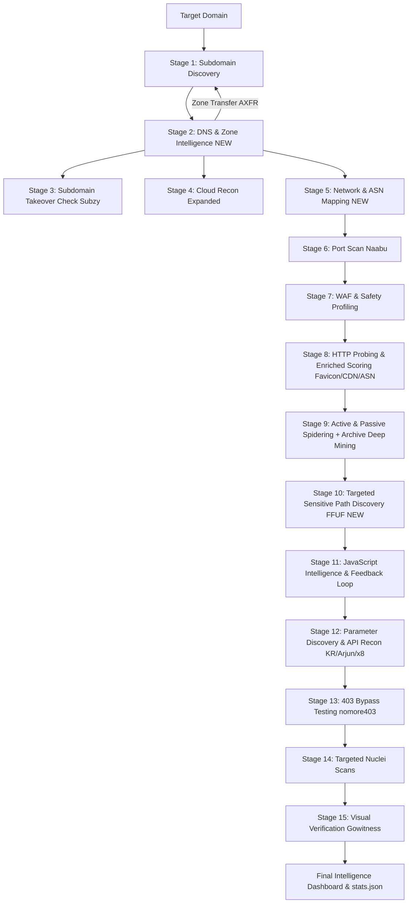

# 🎯 Implementation Plan: Reconnaissance Data Expansion Engine

## Goal Description
The objective is to expand the reconnaissance coverage and data yield of **Recon Framework v3.2.0** (`sozanga3/ReconFramework`). Currently, the framework excels at discovering subdomains, crawling endpoints, and discovering parameters. However, significant attack surface intelligence remains untapped:
1. **Full DNS Architecture & Zone Transfers**: Extracting complete DNS record sets (`TXT`, `CNAME`, `MX`, `NS`, `A`, `AAAA`) and testing for DNS Zone Transfers (`AXFR`).
2. **Network Infrastructure & ASN / Origin Discovery**: Mapping discovered IPs to ASNs, identifying dedicated CIDR blocks, and isolating potential origin IPs by filtering out CDN/Cloudflare/Akamai proxy nodes.
3. **Favicon Fingerprinting & Origin Cross-Correlation**: Extracting and indexing Favicon Murmur3/MD5 hashes via `httpx` to locate hidden portals, dev instances, and Spring Boot / Jenkins / Keycloak assets.
4. **Targeted Sensitive Path & Configuration Discovery**: Performing fast, intelligent exposure probing (`.git/HEAD`, `.env`, `/actuator`, `/swagger.json`, `/.well-known/`) using the installed `/usr/bin/ffuf` on top-ranked targets.
5. **Historical Archive Deep Mining**: Mining passive web archive collections (`gau`, `waybackurls`, `waymore`) for sensitive file extensions (`.sql`, `.bak`, `.old`, `.zip`, `.conf`) and API route patterns.
6. **Multi-Cloud Permutation Expansion**: Expanding cloud storage permutations and adding Firebase and Alibaba Cloud OSS coverage.

All changes strictly comply with [AGENTS.md](file:///home/akram/Documents/recon_framework-3.2.0/AGENTS.md) and [CONTEXT.md](file:///home/akram/Documents/recon_framework-3.2.0/CONTEXT.md), guaranteeing zero tool flag hallucinations, zero scope bleed, centralized configuration, and graceful degradation when optional tools are unavailable.

---

## User Review Required

> [!IMPORTANT]
> **Active Network Probing Considerations**:
> - The new **Sensitive Path Discovery** stage will utilize `/usr/bin/ffuf` with a curated, low-volume wordlist (~50-100 high-value paths such as `/.git/HEAD`, `/.env`, `/swagger.json`, `/actuator/health`). To prevent WAF triggering, it will inherit the `dynamic_rl` rate limit and safety profile.
> - The new **DNS Record Harvesting** will use `dnsx` (which is already installed) to dump structured records without causing heavy network load.

> [!NOTE]
> **Zero Breaking Changes**:
> - All new stages will integrate seamlessly with `--resume`, `--monitor`, and default CLI executions.
> - New output files will reside in dedicated, clean subdirectories (`dns/`, `network/`, `content/`) inside `output/<domain>/`.

---

## Proposed Pipeline Architecture



---

## Proposed Changes

### Component 1: Configuration & Binary Resolution

Declare newly integrated system tools and configurable thresholds in centralized locations without hardcoding.

#### [MODIFY] [config/tools.py](file:///home/akram/Documents/recon_framework-3.2.0/config/tools.py)
- Register `FFUF = resolve_tool("ffuf", ["/usr/bin/ffuf"])`
- Register `DIG = resolve_tool("dig", ["/usr/bin/dig"])`
- Register `DNSRECON = resolve_tool("dnsrecon", ["/usr/bin/dnsrecon"])`
- Register `WHOIS = resolve_tool("whois", ["/usr/bin/whois"])`
- Add these tools to `OPTIONAL_TOOLS` and `ALL_TOOLS`.

#### [MODIFY] [config/settings.py](file:///home/akram/Documents/recon_framework-3.2.0/config/settings.py)
- Add DNS recon settings:
  ```python
  DNSX_RECON_RATE_LIMIT = 150
  AXFR_TIMEOUT = 15
  ```
- Add FFUF path discovery settings:
  ```python
  FFUF_THREADS = 15
  FFUF_RATE_LIMIT = 30
  FFUF_TIMEOUT = 120
  ```
- Add sensitive path definitions (e.g. `HIGH_VALUE_EXPOSURE_PATHS` for `.git/HEAD`, `.env`, `actuator`, `swagger`, `openapi`, etc.).
- Add historical archive sensitive extension patterns (`ARCHIVE_SENSITIVE_EXTENSIONS`).

---

### Component 2: Core Infrastructure & Output Scaffolding

Ensure all new intelligence categories have dedicated directories and serialization logic.

#### [MODIFY] [core/output.py](file:///home/akram/Documents/recon_framework-3.2.0/core/output.py)
- Add directories in `create_output_structure`:
  - `paths['dns'] = f"{base}/dns"`
  - `paths['network'] = f"{base}/network"`
  - `paths['content'] = f"{base}/content"`
- Update `generate_summary` to display metrics for:
  - DNS records harvested (CNAMEs, TXT tokens, MX records)
  - ASNs / Origin IP ranges discovered
  - Favicon hashes and identified frameworks
  - High-value sensitive files exposed (`.git`, `.env`, API docs)

---

### Component 3: New & Enriched Reconnaissance Modules

#### [NEW] [modules/dns_recon.py](file:///home/akram/Documents/recon_framework-3.2.0/modules/dns_recon.py)
- **`harvest_dns_records(subs, domain, paths, base_latency=5, rate_limit=None)`**:
  - Executes `dnsx` with `-recon`, `-json`, `-cname`, `-txt`, `-mx`, `-ns`, `-a`, `-aaaa` on the discovered subdomains.
  - Extracts and separates:
    - `cnames.txt` (subdomain -> canonical name mapping, ideal for dangling DNS / takeover checks).
    - `txt_records.txt` (parsing SPF, verification records: `google-site-verification`, `atlassian-domain-verification`, `MS=`, etc.).
    - `mx_records.txt` (mail exchanges).
    - `a_records.json` (host -> IP mappings for downstream network reconnaissance).
    - `dns_records.json` (full structured record database).
- **`check_zone_transfer(domain, paths, base_latency=5)`**:
  - Discovers authoritative nameservers for `domain` via `dig NS` or python `dns.resolver`.
  - Attempts `dig AXFR @<nameserver> <domain>` against each authoritative server using `core.runner.run_command`.
  - If a zone transfer succeeds, parses all extracted records, logs an alert, and feeds newly discovered subdomains into the pipeline!

#### [NEW] [modules/network_recon.py](file:///home/akram/Documents/recon_framework-3.2.0/modules/network_recon.py)
- **`run_network_recon(resolved_ips, domain, paths)`**:
  - Groups unique IP addresses discovered during DNS resolution.
  - Differentiates Cloud/CDN IPs (Cloudflare, Akamai, Cloudfront, Fastly) using known ASN and IP ranges.
  - For non-CDN IPs (potential origin servers), queries ASN and CIDR information via `whois` or local lookup.
  - Saves:
    - `output/<domain>/network/ips_all.txt`
    - `output/<domain>/network/origin_candidates.txt` (non-CDN IP addresses)
    - `output/<domain>/network/asns.json` (ASN numbers and organizations)
    - `output/<domain>/network/cidrs.txt` (discovered netblocks)

#### [MODIFY] [modules/httpx.py](file:///home/akram/Documents/recon_framework-3.2.0/modules/httpx.py)
- Update `run_httpx` and `parse_httpx`:
  - Preserve `favicon` (MD5 and mmh3 hash), `cdn` (CDN name and boolean flag), `asn` (ASN ID and organization), `webserver`, and `cname`.
  - Store full `ranked.json` strictly matching the schema in `AGENTS.md`:
    ```json
    {
        "url": "https://api.example.com",
        "score": 42,
        "status_code": 200,
        "content_length": 1450,
        "title": "Swagger UI",
        "technologies": ["OpenAPI", "Express"],
        "cdn": false,
        "asn": "AS13335",
        "webserver": "nginx",
        "favicon_hash": "116323821"
    }
    ```
  - Generate `output/<domain>/httpx/favicons.json` mapping unique favicon hashes to URLs.

#### [NEW] [modules/content_discovery.py](file:///home/akram/Documents/recon_framework-3.2.0/modules/content_discovery.py)
- **`run_content_discovery(targets, paths, base_latency=5, rate_limit=None, safety_profile=None)`**:
  - Runs `/usr/bin/ffuf` against top-ranked targets using a curated wordlist of high-impact paths:
    - `.git/HEAD`, `.env`, `.env.local`, `config.json`, `web.config`
    - `swagger.json`, `openapi.json`, `swagger-ui/index.html`, `api/v1/openapi.json`
    - `actuator/health`, `actuator/env`, `metrics`, `prometheus`
    - `robots.txt`, `sitemap.xml`, `security.txt`, `.well-known/security.txt`
  - Passes rate limits (`-rate`), safe timeouts, `-mc 200,204,301,302,307,401,403`, and matches/filters noise.
  - Validates hits (e.g. verifies that `/.git/HEAD` actually contains `ref: refs/` to avoid soft-404 false positives).
  - Saves:
    - `output/<domain>/content/sensitive_exposures.json`
    - `output/<domain>/content/discovered_paths.txt`

#### [MODIFY] [modules/crawler.py](file:///home/akram/Documents/recon_framework-3.2.0/modules/crawler.py)
- In `run_url_collection`:
  - Deep-mine the passive URLs retrieved from `gau`, `waybackurls`, and `waymore`.
  - Filter and categorize:
    - `archive_sensitive_files.txt`: endpoints ending in `.sql`, `.bak`, `.old`, `.zip`, `.dump`, `.log`, `.env`, `.config`.
    - `archive_api_routes.txt`: historical API paths (`/api/v*`, `/rest/v*`, `/graphql`, `/v1/`, `/v2/`).
  - Feed discovered high-value endpoints into downstream parameter discovery and Nuclei target pools.

#### [MODIFY] [modules/cloud_recon.py](file:///home/akram/Documents/recon_framework-3.2.0/modules/cloud_recon.py)
- Expand permutation engine:
  - Generate permutations based on subdomain tokens (e.g. `api-company`, `prod-company`, `company-data`).
  - Add probes for Alibaba Cloud OSS (`https://{name}.oss-cn-hangzhou.aliyuncs.com`) and Firebase (`https://{name}.firebaseio.com/.json`).

---

### Component 4: Pipeline Coordination & Final Reporting

#### [MODIFY] [main.py](file:///home/akram/Documents/recon_framework-3.2.0/main.py)
- Import new modules: `run_dns_recon`, `check_zone_transfer`, `run_network_recon`, `run_content_discovery`.
- Integrate stages cleanly into `main()`:
  - Run DNS Harvesting & Zone Transfer right after Subdomain Enumeration.
  - Run Network Recon on resolved IPs.
  - Run Content Discovery on Top Targets right after HTTP probing.
- Update `tool_metrics` and `stats.json` schema to include:
  - `dns_records`: total count of DNS records.
  - `origin_ips`: count of non-CDN origin candidates.
  - `sensitive_exposures`: count of verified exposed files/paths.
  - `archive_sensitive`: count of discovered historical backups/configs.
- Update console summary table to present the newly harvested intelligence.

---

## Verification Plan

### Automated Tests
1. **Compilation Check**:
   ```bash
   python3 -m py_compile main.py core/*.py modules/*.py config/*.py
   ```
2. **Tool Status Validation**:
   ```bash
   python3 main.py --check-tools
   ```
   Verify that `ffuf`, `dig`, `whois`, and `dnsrecon` are identified correctly without errors.
3. **Unit Validation on Test Target**:
   Run a targeted scan with `--top 2` on an authorized test domain to verify that:
   - `output/<target>/dns/` contains `dns_records.json`, `cnames.txt`, and `txt_records.txt`.
   - `output/<target>/network/` contains `origin_candidates.txt` and `asns.json`.
   - `output/<target>/content/` contains `sensitive_exposures.json`.
   - `output/<target>/stats.json` reflects the expanded metrics.
   - `--resume` works as expected without re-running finished stages.

### Manual Verification
- Review generated reports in `output/<target>/` to confirm zero scope bleed and no duplicate endpoints.
- Check that no out-of-scope domains or CDN false positives leak into `all.txt` or `stats.json`.
